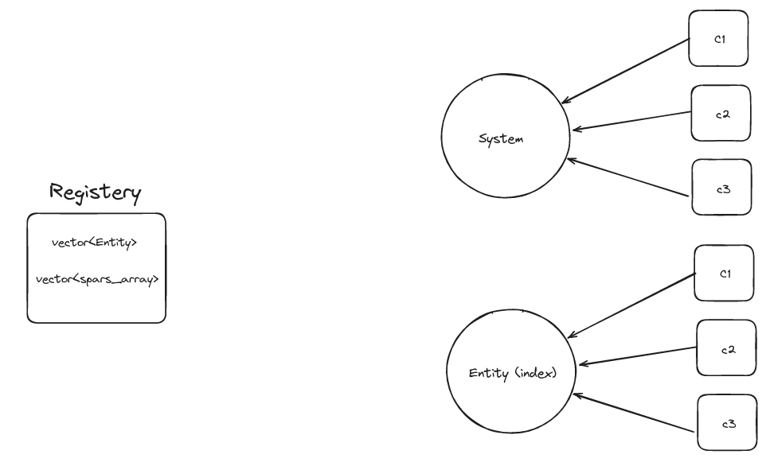

# GAME ENGINE (ECS)

Entity component system (ECS) is a software architectural pattern mostly used in video game development for the representation of game world objects. An ECS comprises entities composed from components of data, with systems which operate on entities' components.

## Sparse Array

  The Sparse Array is a container of components. It is represented by an integer. When an entity is created, it is added to the sparse array of entities. This one is a vector of integers. The index of the vector is the entity id and the value is the index of the entity in the component. When an entity is destroyed, the entity is removed from the sparse array.

  each entity has a list of components and each component is an any which can be equal to a certain value or None.
  

## Component

  
A component is a container of data. It is represented by an integer. When a component is created, it is added to the sparse array of components.
  example of a component :

    struct Position {
        float x;
        float y;
    };
  

## Adding component to entity

  
When the system is called, it parse the list of entity and add the component to the entity if the component is not already added.

  
For example: When I add a velocity component to entity 1, the system parse the list of entity and add the velocity component to the position component.

  

## System Operation

  
Systems are responsible for defining the behavior of entities by operating on their components. The System class in the provided code includes a method display_drawable() that demonstrates how to iterate over entities with a Drawable component and display relevant information.

    void System::display_drawable() {
        auto &draw = reg.getComponent<Drawable>();

        for (auto &i : draw) {
            if (i) {
                std::cout << "Drawable entity: " << i.value().isDrawable << std::endl;
            }
        }
    }

## Registery

  
The registery class is the parent class of the ecs. It contains the program's various classes, such as the system class and the entity class.

  
The registery class contains, for example, the sparse array which, as mentioned above, contains all components and entities

  
