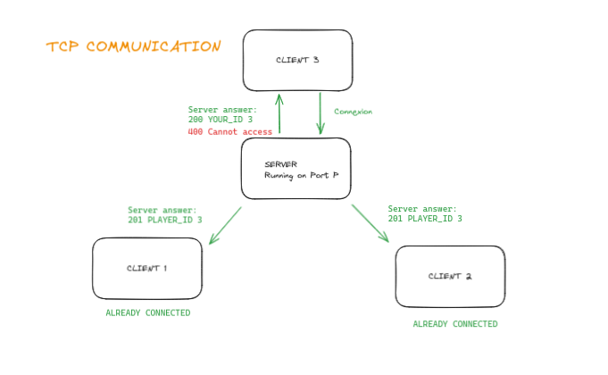
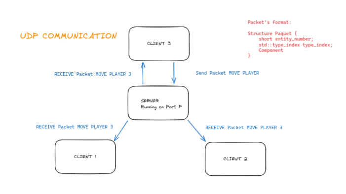

# Network Protocol

Communication protocols are essential in the field of computer networks to enable the exchange of information between different devices. Two widely used protocols in this context are TCP (Transmission Control Protocol) and UDP (User Datagram Protocol). You will see below the differences between these two protocols and how they work.


## TCP (Transmission Control Protocol)

<details>
  <summary><code>TCP</code></summary>
  <p>TCP is a connection-oriented and reliable protocol. It is often used in situations where data loss is not acceptable, such as file transfer or web browsing.</p>
  <p>In the R-Type project, we use TCP to keep a connection between the client and the server. With that, if the client is disconnected, the server will be notified and will be able to remove the client from the game.
</p>

</details>

## UDP (User Datagram Protocol)

<details>
  <summary><code>UDP</code></summary>
  <p>UDP is a connectionless and unreliable protocol. It is often used in situations where data loss is acceptable, such as video streaming or online gaming. (like our project)</p>
  <p>UDP is a connectionless and unreliable protocol. It is often used in situations where data loss is acceptable, such as video streaming or online gaming.</p>
  
</details>

## Communication


All the game information is sent through the network using a protocol that we created. This protocol is composed of 2 parts the packet and the component :

- <summary><code>Magic mumber</code></summary>
  <p>The magic number is a number that is used to identify the protocol. It is used to know if the packet received is a packet of the game or not.</p>

- <summary><code>Packet type</code></summary>
  <p>The packet type is used to know what type of packet is received. It is used to know if the what kind of packet it is.</p>

- <summary><code>Entity ID</code></summary>
  <p>The Entity ID is a unique identifier for each entity in the game. It is used to identify the entity that will receive the component.</p>

- <summary><code>Timestamp</code></summary>
  <p>The timestamp is a number that represents the time when the packet was sent. It is used to know if the packet is still valid.</p>

- <summary><code>type_index</code></summary>
  <p>The type_index is an index that represents the type of the component. It is used to know which component will be sent.</p>

- <summary><code>Component</code></summary>
  <p>The component is the data that will be sent. It is used to update the entity on the client side.</p>

```cpp
struct Packet
{
    uint32_t magic_number;
    PacketType packet_type;
    long timestamp;
    uint32_t entity_id;
    uint32_t type_index;
};
```

The <code>PacketType</code> is an enum that contains all the types of packets that can be sent. 
```cpp
enum PacketType {
    DATA_PACKET = '0',
    REPEAT_PACKET = '1',
    RESPONSE_PACKET = '2',
    NEW_CONNECTION = '3',
};
```